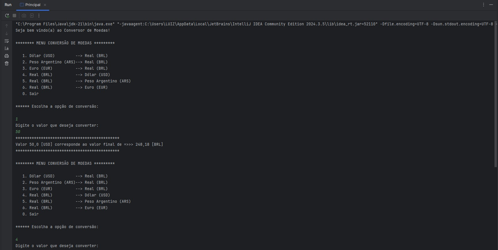

# 💰 Conversor de Moedas <br>


---

## Sobre o projeto

Projeto simples de um conversor de moedas desenvolvido em **Java**, que consome uma API externa para obter taxas de câmbio em tempo real e realizar conversões entre diferentes moedas. <br>
<br>
Este projeto foi desenvolvido durante minha fase inicial de aprendizado em Java, com o objetivo de aplicar conceitos fundamentais como consumo de APIs REST, processamento de JSON e interação via console.

---

## Funcionalidades

- Menu interativo no console
- Conversão de moedas em tempo real
- Consumo de API externa de câmbio
- Entrada de valor pelo usuário
- Exibição do resultado formatado

---

## Tecnologias utilizadas

- Java
- API de taxas de câmbio (Ex: ExchangeRate API)
- HttpClient (Java 11+)
- Gson (ou biblioteca usada para JSON, se aplicável)

---

## Configuração da API

Este projeto utiliza a API de taxas de câmbio da [ExchangeRate API](https://www.exchangerate-api.com/). 

Para executar o projeto, é necessário gerar uma chave de acesso gratuita:

### Passo a passo:

1. Acesse: https://www.exchangerate-api.com/
2. Cadastre-se informando seu e-mail
3. Após o cadastro, você receberá sua **API Key**

### Definindo a variável de ambiente 

#### Windows (PowerShell)
```bash
$env:API_KEY_CONVERSOR="sua_chave_aqui"
```

#### Linux/macOS:
```bash
export API_KEY_CONVERSOR="sua_chave"
```
> !!! Após definir a variável de ambiente, pode ser necessário reiniciar o terminal ou a IDE para que ela seja reconhecida.<br>

---

## Como executar o projeto

### 1. Clone o repositório
```bash
git clone https://github.com/Kathlynleticia/conversor-de-moedas
```

### 2. Abra o projeto em sua IDE

Recomendado: IntelliJ IDEA

### 3. Execute a classe principal

Rode a classe Main para iniciar o programa.

### 4. Demonstração
<br>


<br>

---
## Aprendizados

- Consumo de APIs REST em Java  
- Requisições HTTP com `HttpClient`  
- Leitura e processamento de JSON  
- Entrada e saída de dados no console  
- Uso de variáveis de ambiente para segurança  

### 🙋🏻 Autor

Projeto desenvolvido por Kathlyn Santos durante os estudos iniciais em Java.
